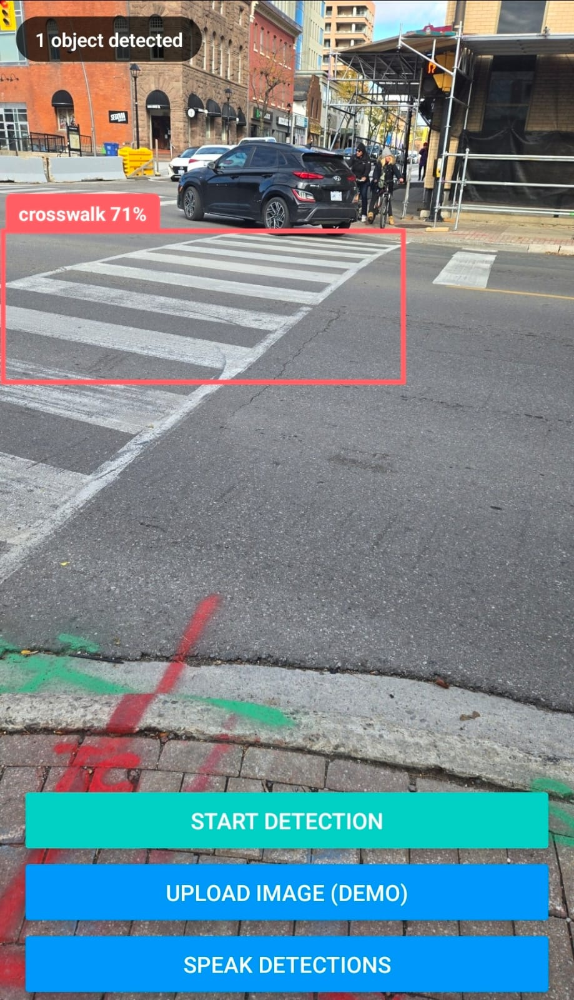
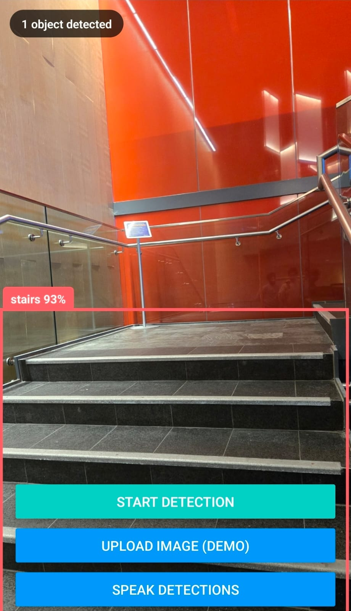
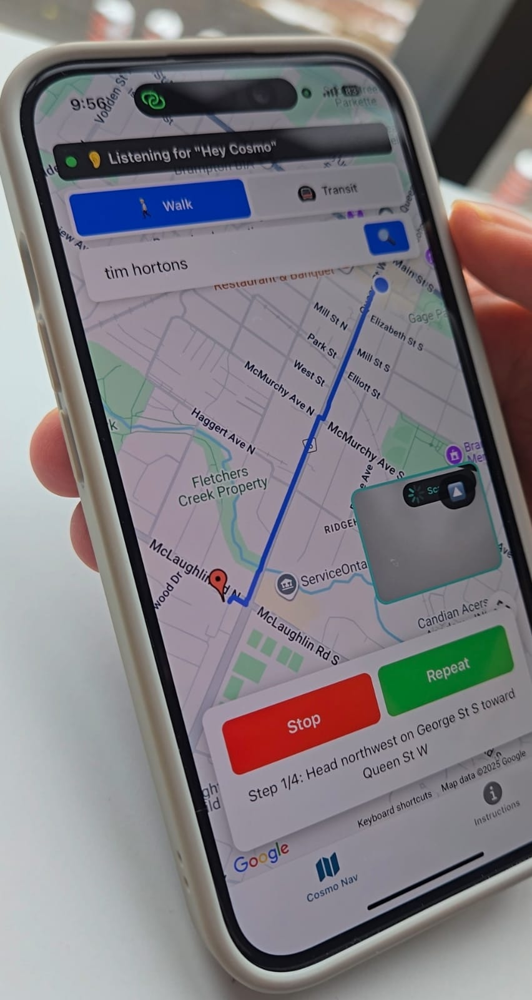

# CosmoNav - AI-Powered Navigation for the Visually Impaired

> **Note:** This project was built in 48 hours for the BramHacks Hackathon. It wouldn't have been possible without my teammates [@YeehawMcfly](https://github.com/YeehawMcfly) and [@Singh-Gursimar](https://github.com/Singh-Gursimar)

In 1957, we launched Sputnik, humanity's first satellite. In the decades that followed, we built a Global Positioning System that mapped the entire planet. Today, billions of us carry access to real-time data of every street inside our pockets.

However, we've overlooked one important thing: safe navigation for the visually impaired. Even today, tens of millions of people find it challenging to reach the curb from their doors on their own.

This weekend at BramHacks, my team and I decided to bridge the gap that we call ‘The Final Frontier’.

## Overview

CosmoNav is an AI-powered, navigation app designed for visually impaired users that combines real-time object detection with voice-activated navigation. The app features a wake word ("Cosmo") activation system with continuous audio monitoring and automatic pause detection, allowing users to search for destinations and navigate completely hands-free without pressing any buttons. To make this all possible, it combines:

- Computer vision for obstacle detection using the device camera and my own segmentation model
- Voice recognition through AssemblyAI for speech-to-text processing
- Google Maps for routing and navigation

All in all, CosmoNav creates a comprehensive accessibility solution that announces detected objects, provides turn-by-turn voice guidance, and enables fully autonomous interaction through voice commands alone.

## Demos

> The video demonstrations of the YOLOv11 instance segementation model and the app's voiced-controlled navigation service can be found in [presentation_materials/](presentation_materials/)

**Custom Fine-Tuned Model:**

<table>
  <tr>
    <td align="center">
      <em>Model detecting a crosswalk</em><br>
      
    </td>
    <td align="center">
      <em>Model detecting stairs</em><br>
      
    </td>
  </tr>
</table>

**Voice Controlled Navigation:**

<table>
  <tr>
    <td align="center">
      <em>Voice-activated location search</em><br>
      
    </td>
    <td align="center">
      <em>Turn-by-turn navigation starting</em><br>
      
    </td>
  </tr>
</table>

## Installation

1. First make a repo somewhere nice
2. Do `git clone https://github.com/AbiPatti/cosmonav-demo.git` in that directory
3. Create a .env file and add the following:
   ```
   EXPO_PUBLIC_GOOGLE_MAPS_API_KEY=your_google_maps_api_key
   EXPO_PUBLIC_SPEECH_TO_TEXT_API_KEY=your_assemblyai_api_key
   EXPO_PUBLIC_ROBOFLOW_API_KEY=your_roboflow_api_key
   EXPO_PUBLIC_ROBOFLOW_API_URL=your_roboflow_model_url
   ```
4. Do `npm install`
5. Do `npx expo install expo-av` (for voice search support)
6. Do `npx expo start --tunnel`
7. Install Expo Go on your phone
8. Scan the QR code with your phone to run the app!

### Voice Search Setup

To use fully voice-activated navigation with wake word "Cosmo":
1. Create an account at https://www.assemblyai.com
2. Get your API key from the dashboard
3. Add it to the .env file as `EXPO_PUBLIC_SPEECH_TO_TEXT_API_KEY`
4. Install audio support: `npx expo install expo-av`

#### How Voice Activation Works:
The app uses **continuous wake word detection** and **automatic pause detection** - completely hands-free!

- **🎙️ Always Listening**: Uses a continuous recording loop that never stops
- **3-Second Cycles**: Records 3 seconds, checks for "Cosmo", immediately starts next cycle
- **Wake Word**: Say "Cosmo" to activate voice search
- **Automatic Search on Pause**: 
  - Say your search query and **pause for 3 seconds**
  - The app automatically detects the pause and processes your search
  - Example: "Cosmo" → "coffee shops near me" → **[pause 3 seconds]** → searches automatically
  - No need to press any buttons!
- **Smart Silence Detection**: 
  - Monitors audio levels every 500ms
  - Detects when you stop speaking
  - Automatically processes search after 3 seconds of silence
  - Maximum recording time: 20 seconds
- **Auto-Resume**: After each search, automatically resumes the listening loop
- **Smart Pause**: Pauses during active navigation, auto-resumes when navigation ends
- **Visual Feedback**:
  - Orange banner: "Listening for Cosmo..." (actively recording)
  - Red banner: "Speak your search, then pause for 3 seconds..." (voice command mode)
  - Gray banner: "Voice inactive" with restart button (if stopped)

**Check the console logs** to see the pause detection in action:
- `Starting new recording cycle...` (every 3 seconds)
- `Silence detected (1.5s)` (counting silence)
- `3 seconds of silence detected, processing speech...` (auto-search triggered)
- `Transcribed: [what you said]`
- `Wake word detected!` (when you say Cosmo)

**Completely hands-free!** Just say "Cosmo", speak your search, and pause. 🚀

## Technologies

**Core Framework**

- **React Native** - Cross-platform mobile development
- **Expo** - Development platform and tooling
- **TypeScript** - Type-safe JavaScript

**Computer Vision & AI**

- **Roboflow** - Instance segmentation & object detection API
- **expo-camera** - Real-time camera access and frame capture
- **expo-image-manipulator** - Image resizing and preprocessing

**Voice & Audio**

- **AssemblyAI** - Real-time speech-to-text transcription
- **expo-speech** - Text-to-speech for voice announcements
- **expo-av** - Audio recording for wake word detection
- Custom wake word detection system ("Cosmo")
- Automatic silence detection (3-second pause)

**Navigation & Maps**

- **Google Maps API** - Geocoding, places search, and routing
- **Google Maps JavaScript API (WebView)** - Interactive map display
- **expo-location** - GPS positioning and location tracking

**Additional Features**
- **expo-image-picker** - Demo image upload mode
- Continuous audio loop for hands-free operation
- Real-time bounding box overlays for detected objects
- Voice-activated search with autocomplete

## Future Steps

- Improve image detection model by acquiring compute power and training it on a massive dataset.
- Ensure Speech to Text works seamlessly.
- Partner with a hardware (preferably spectacles) company to reduce dependence on phones.
- Reach out to institutions like the Canadian National Institute for the Blind (CNIB) to get feedback from future users.

## License
>This project is licensed under the MIT License. See [LICENSE](LICENSE) for more details.
